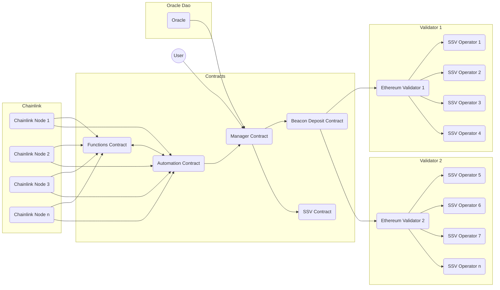

# Architecture

Casimir distributes user deposits to Ethereum validators operated by SSV nodes. Validator keys are generated and reshared using distributed key generation (DKG). Chainlink nodes report from the Beacon chain and SSV network to sync balances and rewards, manage collateral recovery, and trigger validator activation, resharing, and exits.

## Oracles

The contract uses two oracles to automate the Casimir staking experience and ensure the security of user funds. The upkeep (automation) contract reports total validator balance, swept balance, and validator actions once per day using a [Chainlink Functions](https://docs.chain.link/chainlink-functions) oracle and [Chainlink Automation](https://docs.chain.link/chainlink-automation/introduction). The DAO oracle watches contract events and triggers distributed key generation (DKG) operations.