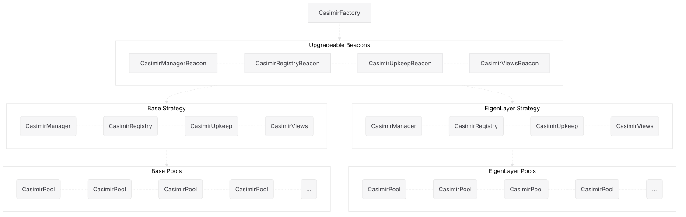

::: warning
This page is incomplete.
:::

# Architecture

The Casimir staking architecture consists of the following components:

- An [Ethereum RPC Node](#ethereum-rpc-node) that connects the SSV DVT node to the Ethereum network.
- An [SSV Node](#ssv-node) that performs cluster duties for validators.
- An [SSV DKG server](#ssv-dkg-server) that participates in key generation and resharing ceremonies.

<!-- The Casimir staking system consists of the following components:

- A [factory contract](#factory-contract) that manages the creation of [staking strategies](#staking-strategies), each with a distinct [manager contract](#manager-contract), [registry contract](#registry-contract), [upkeep contract](#upkeep-contract), and [views contract](#views-contract).
-  -->
