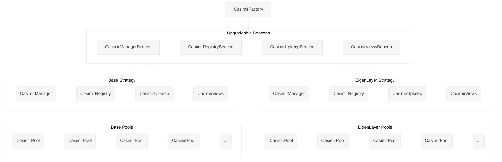

::: warning
This page is incomplete.
:::

# Architecture

Todo. Explain stakeholders and their entrypoints. Internal contracts, external contracts, operators, oracles, etc.

## Contracts

Casimir deploys the following contracts:

- A [Casimir factory](#casimir-factory) that configures and deploys staking strategies.
- For each staking strategy:
  - A [Casimir manager](#casimir-manager) that accepts any amount of stake and distributes it to validator pools.
  - A [Casimir registry](#casimir-registry) that registers operators and binds collateral to validators pools. 
  - A [Casimir upkeep](#casimir-upkeep) that automates distributed consensus layer reports.
  - A [Casimir views](#casimir-views) that provides a read-only interface to the strategy.
  - For each validator pool:
    - A [Casimir pool](#casimir-pool) that either serves as the withdrawal address for a validator or provides a proxy to the withdrawal address.
- A [Casimir oracle](#casimir-oracle) that executes operator selection, triggers DKG ceremonies, submits verifiable validator creation, resharing, and exit reports, and allocates reserved operational fees to operators.

As we add new strategies and features leading up to our mainnet release, the contracts will require upgrades. Accordingly, the Casimir factory is deployed as a transparent proxy, while the other contracts are deployed as beacon proxies.

