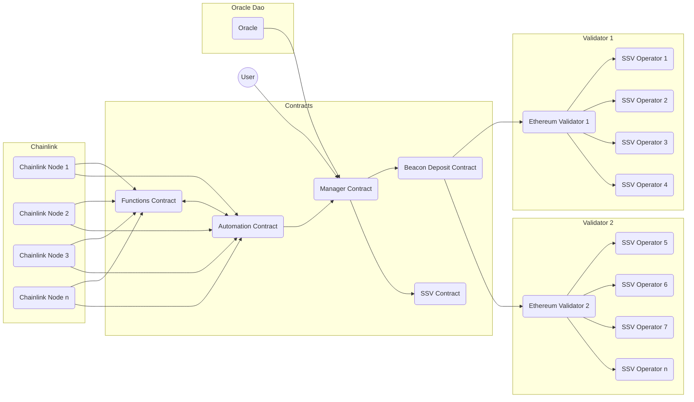

# @casimir/ethereum

Solidity contracts for decentralized staking on Ethereum

## About

Currlently stakers either need to solo-stake (and have least 32 Ether), or they need to pool their assets in a liquid staking protocol (LSD). While the former choice is a reliably secure choice for Ether holders (if they have solid infrastructure), the latter, LSDs, often present an inherent counterparty risk to the user because of  their centralized control of staking node operators (see [The Risks of LSD](https://notes.ethereum.org/@djrtwo/risks-of-lsd)).

Casimir is designed to offer users the experience and security of solo-staking while pooling their assets. The Casimir contracts seamlessly connect stakers with any amount of Ether to a permissionless registry of high-performing node operators. Casimir aims to minimize counterparty risk for users and improve decentralization in Ethereum staking:

- Validators duties are performed by registered (collateralized) operators running distributed validator technology (DVT)
- Keys are created and reshared using distributed key generation (DKG)
- Automated balance and status reports are carried out by a decentralized oracle network (DON)

## Development

**All testing and development commands should be run from the repository root.**

See the [@casimir/ethereum section] in the [main README](../../README.md#casimirethereum) for testing and development instructions.

Build the contracts (without any tests or development environment).

```zsh
# From the repository root
npm run build --workspace @casimir/ethereum
```

To directly run any script in the [@casimir/ethereum package.json](./package.json), use the `--workspace @casimir/ethereum` flag.

```zsh
# From the repository root
npm run <script> --workspace @casimir/ethereum
```

## Architecture

Casimir distributes user deposits to Ethereum validators operated by SSV. Validator keys are shared with zero-coordination distributed key generation. Chainlink nodes report from the Beacon chain and SSV to sync balances and rewards, manage collateral recovery, and automate validator creation and exits.



## Contracts

Casimir v1 contains five internal contracts with interfaces and uses a suite of vendor contracts from Chainlink, OpenZeppelin, SSV, and Uniswap. All contract source code is located in the [./src/v1](./src/v1) directory. A Hardhat environment for development and deployment is configured in the [hardhat.config.ts](./hardhat.config.ts) file.

**Internal Contracts:**

Core internal contracts and interfaces are located in the root of the [src/v1](./src/v1) directory.

| Contract | Description | Docs |
| --- | --- | --- |
| [CasimirManager](./src/v1/CasimirManager.sol) | Accepts and distributes deposits | [docs/index.md#casimirmanager](./docs/index.md#casimirmanager) |
| [CasimirPool](./src/v1/CasimirPool.sol) | Accepts deposits and stakes a validator | [docs/index.md#casimirpool](./docs/index.md#casimirpool) |
| [CasimirRegistry](./src/v1/CasimirRegistry.sol) | Manages operator registration | [docs/index.md#casimirregistry](./docs/index.md#casimirregistry) |
| [CasimirUpkeep](./src/v1/CasimirUpkeep.sol) | Automates and handles reports | [docs/index.md#CasimirUpkeep](./docs/index.md#CasimirUpkeep) |
| [CasimirViews](./src/v1/CasimirViews.sol) | Provides read-only access to state | [docs/index.md#casimirviews](./docs/index.md#casimirviews) |
| [Types](./src/v1/libraries/Types.sol) | Defines internal types | [docs/index.md#types](./docs/index.md#types) |

**Vendor Contracts:**

Vendor contracts and interfaces are located in the [src/v1/vendor](./src/v1/vendor) directory, or they are imported directly from installed libraries.

| Contract | Description | Docs |
| --- | --- | --- |
| [AutomationRegistry](../../node_modules/@chainlink/contracts/src/v0.8/interfaces/AutomationRegistryInterface2_0.sol) | Subscribes and funds upkeeps | – |
| [DepositContract](./src/v1/vendor/interfaces/IDepositContract.sol) | Accepts Beacon deposits | – |
| [ERC20](../../node_modules/@openzeppelin/contracts/token/ERC20/IERC20.sol) | Standardizes tokens | – |
| [FunctionsClient](../../node_modules/@chainlink/contracts/src/v0.8/dev/functions/FunctionsClient.sol) | Calls Chainlink Functions | – |
| [KeeperRegistrar](./src/v1/vendor/interfaces/KeeperRegistryInterface.sol) | Allows upkeep subscription registration | – |
| [Math](../../node_modules/@openzeppelin/contracts/utils/math/Math.sol) | Provides math helpers | – |
| [Ownable](../../node_modules/@openzeppelin/contracts/access/Ownable.sol) | Provides ownable access control | – |
| [ReentrancyGuard](../../node_modules/@openzeppelin/contracts/security/ReentrancyGuard.sol) | Secures against reentrancy | – |
| [SSVNetwork](./src/v1/vendor/interfaces/ISSVNetwork.sol) | Registers SSV validators | – |
| [SSVNetworkCore](./src/v1/vendor/interfaces/ISSVNetworkCore.sol) | Provides base SSV logic and types | – |
| [SSVNetworkViews](./src/v1/vendor/interfaces/ISSVNetworkViews.sol) | Provides read-only access to SSV network state | – |
| [SwapRouter](../../node_modules/@uniswap/v3-periphery/contracts/interfaces/ISwapRouter.sol) | Routes token swaps | – |
| [UniswapV3Factory](../../node_modules/@uniswap/v3-core/contracts/interfaces/IUniswapV3Factory.sol) | Provides access to Uniswap V3 pools | – |
| [UniswapV3PoolState](../../node_modules/@uniswap/v3-core/contracts/interfaces/pool/IUniswapV3PoolState.sol) | Provides access to Uniswap V3 pool state | – |
| [WETH](./src/v1/vendor/interfaces/IWETH.sol) | Wraps ETH for swapping | – |

**Mock Contracts:**

Mock (development-only) contracts and interfaces are located in the [src/mock](./src/v1/mock) directory.

| Contract | Description | Docs |
| --- | --- | --- |
| [MockFunctionsOracle](./src/v1/mock/MockFunctionsOracle.sol) | Mocks Chainlink Functions responses | [docs/index.md#mockfunctionsoracle](./docs/index.md#mockfunctionsoracle) |

## Distributed Key Generation

Casimir distributes validator key shares to operators using the [rockx-dkg-cli](https://github.com/RockX-SG/rockx-dkg-cli). The CLI is still in development, but it can be used with the local Hardhat network to generate keys and perform DKG operations. The CLI is integrated into the Casimir oracle – use the `--mock` flag when running `npm run dev:ethereum` to enable the mock DKG CLI. Otherwise, the oracle helper scripts in [./helpers/oracle](./helpers/oracle) will use pregenerated DKG keys.

## Oracles

The contract uses two oracles to automate the Casimir staking experience and ensure the security of user funds. The first oracle (see the [@casimir/functions README.md](../../services/functions/README.md)), the Casimir upkeep, reports total validator balance, swept balance, and validator actions once per day (see [Chainlink Automation](https://docs.chain.link/chainlink-automation/introduction)) using trust-minimized compute infrastructure (see [Chainlink Functions](https://docs.chain.link/chainlink-functions)). The second oracle, the Casimir DAO oracle (see the [@casimir/oracle README.md](../../services/oracle/README.md)), watches the manager contract events and automatically executes zero-coordination distributed key generation (DKG) operations: validator key creating, resharing, and exiting off-chain, and submits ceremony verification proofs. The DAO oracle also submits verifiable report details in response to reported validator actions (like completed exits).

## 👥 Users

Users can deposit any amount of ETH to the manager contract. Their deposits are staked to validators run by SSV operators (see [Operators](./README.md#operators)). Rewards are auto-compounded into stake and users can withdraw their principal plus any earned proportion of new stake (or a partial amount of their choice) at any time.

### User Fees

The contract charges a 5% user fee on deposits and rewards to fund the contract's operations.

**User Fee Calculation:**

1. $ethAmount = depositAmount\times{\frac{100}{100 + feePercent}}$

2. $feeAmount = depositAmount - ethAmount$

*Where:*

- $feePercent$ is the total fee percentage, which is the sum of the required ETH, LINK, and SSV fees.
- $depositAmount$ is the amount of ETH deposited.
- $ethAmount$ is the amount of ETH to be distributed into the contract.
- $feeAmount$ is the amount of ETH to be swapped for LINK and SSV to operate the contract.

### User Stake

The manager contract adjusts a user's stake based on the change in the total reward-to-stake ratio sum since their last interaction with the contract. Each time new rewards are reported, the ratio sum is updated to include the new rewards-to-stake ratio. The ratio sum is used to calculate a user's current stake, including compounded rewards, at any time.

**User Stake Calculation:**

1. Whenever a user deposits or updates their stake, their initial stake and the current ratio sum are recorded.
2. When rewards are distributed, the ratio sum is updated to include the new reward-to-stake ratio.
3. $userStake =userStake_0\times{\frac{stakeRatioSum}{userStakeRatioSum_0}}$ calculates a user's current compounded stake at any time.

*Where:*

- $userStake$ is the calculated current stake of the user, including compounded rewards. This is [**`users[userAddress].stake`**](./docs/index.md#user) in the contract.
- $userStake_0$ is the initial stake of the user at the time of their last deposit or stake update. This is also [**`users[userAddress].stake`**](./docs/index.md#user) in the contract, but it is accessed before settling the user's current stake.
- $stakeRatioSum$ is the current cumulative sum of reward-to-stake ratios in the contract. This is [**`stakeRatioSum`**](./docs/index.md#stakeratiosum) in the contract.
- $userStakeRatioSum_0$ is the cumulative sum of reward-to-stake ratios at the time the user made their last deposit or update to their stake. This is [**`users[userAddress].stakeRatioSum0`**](./docs/index.md#user) in the contract.

### User Withdrawals

Users can request a withdrawal of any amount of their stake at any time. If the requested amount is available in the buffered balance (prepooled balance plus withdrawn balance), the withdrawal is fulfilled immediately. Otherwise, the withdrawal is added to the pending withdrawals queue and fulfilled when the requested amount is available (usually within 1-4 days, depending on the amount).

## 👷 Operators

Each Casimir validator is run by four selected operators holding the key shares to perform duties with threshold signatures on SSV. Registration is open to any SSV operator (see [Operator Registration](./README.md#operatorregistration). Operators are selected by an algorithm that ensures high-performance but emphasizes decentralization (see [Operator Selection](./README.md#operatorselection)) as user's deposit stake and new validators are required.

### Operator Registration

Operators can join the contract registry with a deposit of 4 ETH for collateral (see [Operator Collateral](./README.md#operatorcollateral)) and a lightweight SSV node config add-on (see [Operator Config](./README.md#operatorconfig)).

### Operator Selection

Operators are chosen to run validators based on metrics fetched and derived directly from the SSV network. These metrics are mainly performance, market share, and fees.

If an operator's performance is poor for an extended period of time, or their collateral is below the threshold, Casimir removes the operator from existing operator groups by resharing or exiting. The latter is only required in the case that a validator has already undergone more than two reshares to avoid leaving the full key recoverable outside of the currently selected operators.

### Operator Collateral

Collateral is used to recover lost validator effective balance at the time of completing an exit. The loss blame is assigned to the four responsible operators based on performance over the duration of the validator's existence.

### Operator Config

Operators will need to follow the [node onboarding process from RockX](https://github.com/RockX-SG/rockx-dkg-cli/blob/main/docs/dkg_node_installation_instructions.md) to participate in DKG make their node available to new validator selections. Todo add details.

## Relevant Improvement Proposals

The following improvement proposals for Ethereum and SSV are relevant to Casimir staking:

1. EIP-4788: [Beacon block root in the EVM](https://eips.ethereum.org/EIPS/eip-4788)
   - Result: Individual validator status reports are provable on-chain
2. EIP-7002: [Execution layer triggerable exits](https://eips.ethereum.org/EIPS/eip-7002)
   - Result: Manager contract can trigger validator exits
3. SIP-1: [Generalized DKG support in SSV](https://github.com/bloxapp/SIPs/blob/main/sips/dkg.md)
   - Result: SSV nodes can perform DKG operations natively
