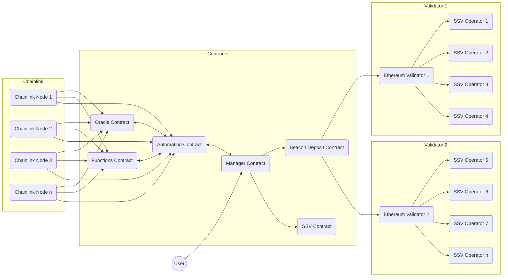

# @casimir/ethereum

Solidity contracts for decentralized staking on Ethereum

## 📝 Overview

Currlently stakers either need to solo-stake (and have least 32 Ether), or they need to pool their assets in a liquid staking protocol (LSD). While the former choice is a secure choice for Ether holders, the latter, LSDs, are more or less designed for Ether traders with higher risk-tolerance. Today's LSDs present an inherent counterparty risk to the user, and they rely on centralized control of staking node operators (see [The Risks of LSD](https://notes.ethereum.org/@djrtwo/risks-of-lsd)).

Casimir is designed to offer users the experience and security of solo-staking while pooling their assets. The Casimir contracts seamlessly connect stakers with any amount of Ether to a permissionless registry of high-performing node operators. Casimir aims to minimize counterparty risk for users and improve decentralization in Ethereum staking:

- Validators duties are performed by registered (collateralized) operators running distributed validator technology (DVT)
- Keys are created and reshared using distributed key generation (DKG)
- Automated balance and status reports are carried out by a decentralized oracle network (DON)

### Architecture

Casimir distributes user deposits to Ethereum validators operated by SSV. Validator keys are shared with zero-coordination distributed key generation. Chainlink nodes report from the Beacon chain and SSV to sync balances and rewards, manage collateral recovery, and automate validator creation and exits.

### Contracts

Casimir deploys two internal contracts and interfaces with suite of vendor contracts from the Consensus Specs, Chainlink, OpenZeppelin, SSV, and Uniswap. All contract source code is located in the [./src](./src) directory. A Hardhat environment for development and deployment is configured in the [hardhat.config.ts](./hardhat.config.ts) file. The following contract scripts can be executed from the **monorepo root** directory:

- `npm run dev:ethereum` - Run a local Ethereum network and deploy contracts
- `npm run test:ethereum` - Run tests for the Ethereum contracts
- `npm run clean --workspace @casimir/ethereum` - Clean the Ethereum build directory
- `npm run build --workspace @casimir/ethereum` - Compile the Ethereum contracts

**Internal Contracts:**

Core internal contracts and interfaces are located in the [src](./src) directory.

| Contract | Description | Docs |
| --- | --- | --- |
| [CasimirManager](./src/CasimirManager.sol) | Manages stake distribution | [docs/index.md#casimirmanager](./docs/index.md#casimirmanager) |
| [CasimirUpkeep](./src/CasimirUpkeep.sol) | Automates event handling | [docs/index.md#CasimirUpkeep](./docs/index.md#CasimirUpkeep) |

**Vendor Contracts:**

Vendor contracts and interfaces are located in the [src/vendor](./src/vendor) directory.

| Contract | Description | Docs |
| --- | --- | --- |
| [DepositContract](./src/vendor/interfaces/IDepositContract.sol) | Accepts Beacon deposits | Todo |
| [Functions](./src/vendor/Functions.sol) | Provides a library for Chainlink functions | Todo |
| [FunctionsBillingRegistry](./src/vendor/interfaces/FunctionsBillingRegistryInterface.sol) | Manages Chainlink function billing | Todo |
| [FunctionsClient](./src/vendor/FunctionsClient.sol) | Executes Chainlink function requests | Todo |
| [FunctionsOracle](./src/vendor/interfaces/FunctionsOracleInterface.sol) | Handles Chainlink function requests | Todo |
| [KeeperRegistry](./src/vendor/interfaces/IKeeperRegistry.sol) | Manages Chainlink upkeeps | Todo |
| [SSVNetwork](./src/vendor/interfaces/ISSVNetwork.sol) | Connects distributed validators | Todo |
| [SSVToken](./src/vendor/interfaces/ISSVToken.sol) | Serves as operator utility token | Todo |
| [WETH](./src/vendor/interfaces/IWETH.sol) | Wraps ETH for swapping | Todo |

**Mock Contracts:**

Mock (development-only) contracts and interfaces are located in the [src/mock](./src/mock) directory.

### Distributed Key Generation

Casimir trustlessly distributes validator key shares to operators using the [rockx-dkg-cli](https://github.com/RockX-SG/rockx-dkg-cli).

### Oracles

The contract loosely depends on two decentralized oracles. The first oracle automatically syncs validator configuration, statuses, and balances when necessary conditions are met (see [Chainlink Automation](https://docs.chain.link/chainlink-automation/introduction)) by performing external requests with trust-minimized compute infrastructure (see [Chainlink Functions](https://docs.chain.link/chainlink-functions)). The second oracle watches the manager contract events, automatically executes zero-coordination distributed key generation (DKG) operations: validator key creating, resharing, and exiting (see [Chainlink Keepers](https://docs.chain.link/chainlink-keepers/introduction)) off-chain, and submits ceremony verification proofs.

## 👥 Users

Users can deposit any amount of ETH to the manager contract. Their deposits are staked to validators run by SSV operators (see [Operators](./README.md#operators)). Rewards are auto-compounded into stake and users can withdraw their principal plus any earned proportion of new stake (or a partial amount of their choice) at any time.

### User Fees

The contract charges a small user fee for each deposit (and some amount TBD in reward distribution) to fund the contract's operations. The fee is a percentage of the amount deposited by a user or reward distibution.

**User Fee Calculation:**

1. $feePercent = fees_{LINK} + fees_{SSV}$

2. $ethAmount = depositAmount\times{\frac{100}{100 + feePercent}}$

3. $feeAmount = depositAmount - ethAmount$

*Where:*

- $fees_{LINK}$ is the LINK fee percentage, which is [**`getLINKFee()`**](./docs/index.md#getlinkfee) in the contract.
- $fees_{SSV}$ is the SSV fee percentage, which is [**`getSSVFee()`**](./docs/index.md#getssvfee) in the contract.
- $feePercent$ is the total fee percentage, which is the sum of the LINK and SSV fees.
- $depositAmount$ is the amount of ETH deposited.
- $ethAmount$ is the amount of ETH to be distributed into the contract.
- $feeAmount$ is the amount of ETH to be swapped for LINK and SSV to operate the contract.

### User Stake

The manager contract adjusts a user's stake based on the change in the total reward-to-stake distribution sum since their last interaction with the contract. Each time new rewards are distributed (after either a heartbeat interval or a threshold change is detected in the oracle), the distribution sum is updated and the new rewards are staked in an auto-compounding fashion.

**User Stake Calculation:**

1. Whenever a user deposits or updates their stake, their initial stake and the current distribution sum are recorded.
2. When rewards are distributed, the distribution sum is updated to include the new reward-to-stake ratio.
3. $userStake =userStake_0\times{\frac{distributionSum}{userDistributionSum_0}}$ calculates a user's current compounded stake at any time.

*Where:*

- $userStake$ is the calculated current stake of the user, including compounded rewards. This is [**`users[userAddress].stake`**](./docs/index.md#user) in the contract.
- $userStake_0$ is the initial stake of the user at the time of their last deposit or stake update. This is also [**`users[userAddress].stake`**](./docs/index.md#user) in the contract, but it is accessed before settling the user's current stake.
- $distributionSum$ is the current cumulative sum of reward-to-stake ratios in the contract. This is [**`distributionSum`**](./docs/index.md#distributionsum) in the contract.
- $userDistributionSum_0$ is the cumulative sum of reward-to-stake ratios at the time the user made their last deposit or update to their stake. This is [**`users[userAddress].distributionSum0`**](./docs/index.md#user) in the contract.

### User Withdrawals

Users can initiate a withdrawal of any amount of their stake at any time. **Full exits and withdrawal liquidity are still a WIP.** In the meantime, valid user withdrawals up to the to total current `readyDeposits` will be fulfilled by the contract. Note, more notes are coming soon on withdrawal liquidity, alongside an additional contract.

## 👷 Operators

Each Casimir validator is run by four selected operators holding key share to perform duties with threshold signatures on SSV. Registration is open to any SSV operator (see [Operator Registration](./README.md#operatorregistration). Operators are selected by an algorithm that ensures high-performance but emphasizes decentralization (see [Operator Selection](./README.md#operatorselection)) as user's deposit stake and new validators are required.

### Operator Registration

Operators can join the contract registry with a small deposit of ETH for slashing collateral (see [Operator Collateral](./README.md#operatorcollateral)) and a lightweight SSV node config add-on (see [Operator Config](./README.md#operatorconfig)).

### Operator Selection

Operators are chosen to run validators based on metrics fetched and derived directly from the SSV network. These metrics are mainly performance, market share, and fees.

Todo @elizyoung0011 - we should add your details about operator selection and performance monitoring thresholds.

Operator performance is reported by (Chainlink) monitoring SSV exporter attestations. If an operator's performance is poor for an extended period of time, and their slashing collateral is below a threshold, Casimir removes the operator from existing operator groups by resharing or exiting. The latter is only required in the case that a validator has already undergone more than two reshares to avoid leaving the full key recoverable outside of the currently selected operators.

### Operator Collateral

Todo add notes.

### Operator Config

Operators will need to follow the [node onboarding process from RockX](https://github.com/RockX-SG/rockx-dkg-cli/blob/main/docs/dkg_node_installation_instructions.md) to participate in DKG make their node available to new validator selections. Todo add details.

## Todo

- [ ] Add notes on operator selection and performance monitoring thresholds
- [ ] Add notes on operator collateral
- [ ] Add notes on relationship between operator selection, performance, and collateral
- [ ] Add notes on operator config
- [ ] Add notes on distributed key generation and oracle integration
