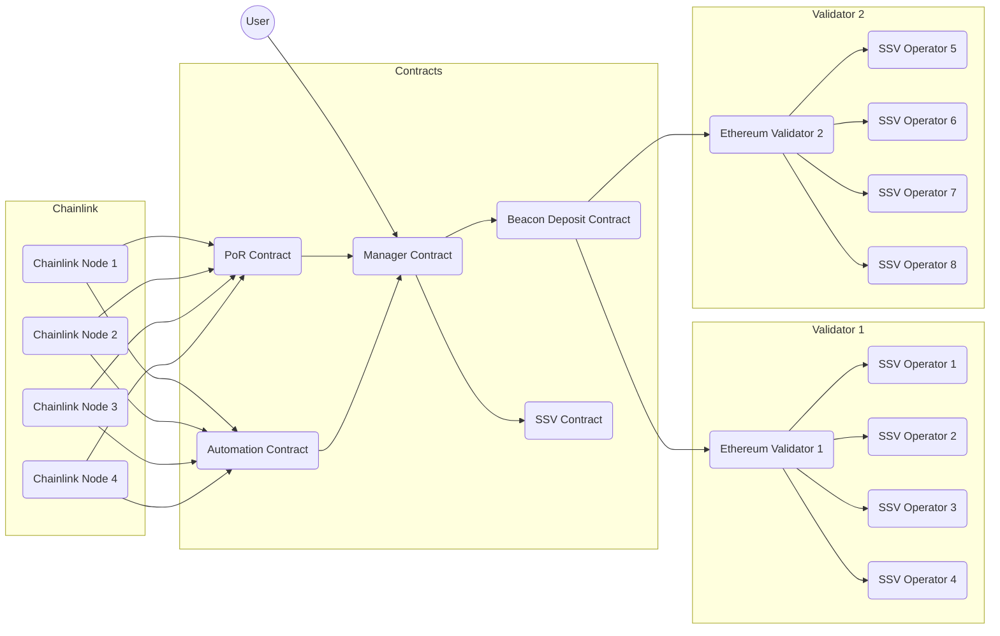

# @casimir/ethereum

Solidity contracts for decentralized applications

## SSV

Casimir receives user deposits with a manager contract, which distributes funds to Ethereum validators operated by SSV operators via the Beacon deposit and SSV contracts. A PoR oracle publishes Beacon balance updates, and an automation oracle responds to on-and-off-chain events. Chainlink nodes run both oracles distributedly. Below is a high-level diagram of the Casimir SSV staking architecture.

The Casimir SSV contracts are located in the [src](./src) directory.

| Contract | Description | Docs |
| --- | --- | --- |
| [CasimirManager](./src/CasimirManager.sol) | Manages Casimir SSV stake distribution | [docs/index.md#casimirmanager](./docs/index.md#casimirmanager) |
| [CasimirAutomator](./src/CasimirAutomation.sol) | Automates Casimir SSV event handling | [docs/index.md#casimirautomator](./docs/index.md#casimirautomator) |

> 🚩 The Casimir SSV contracts are configured with a Hardhat development environment in the [hardhat.config.ts](./hardhat.config.ts) file.

### Compounding

The approach to user stake compounding rewards in the manager contract involves adjusting the user's stake based on the change in the distribution sum since their last interaction with the contract. The distribution sum represents the cumulative sum of reward-to-stake ratios at each reward distribution event. By tracking this sum, the contract can calculate the user's proportion of earned rewards relative to their initial stake and update their stake accordingly.

**Stake Calculation:**

1. Whenever a user deposits or updates their stake, their initial stake and the current distribution sum are recorded.
2. When rewards are distributed, the distribution sum is updated to include the new reward-to-stake ratio.
3. $userStake =userStake_0\times{\frac{distributionSum}{userDistributionSum_0}}$ calculates a user's current compounded stake at any time.

*Where:*

- $userStake$ is the calculated current stake of the user, including compounded rewards. This is [**`users[userAddress].stake`**](./docs/index.md#user) in the contract.
- $userStake_0$ is the initial stake of the user at the time of their last deposit or stake update. This is also [**`users[userAddress].stake`**](./docs/index.md#user) in the contract, but it is accessed before settling the user's current stake.
- $distributionSum$ is the current cumulative sum of reward-to-stake ratios in the contract. This is [**`distributionSum`**](./docs/index.md#distributionsum) in the contract.
- $userDistributionSum_0$ is the cumulative sum of reward-to-stake ratios at the time the user made their last deposit or update to their stake. This is [**`users[userAddress].distributionSum0`**](./docs/index.md#user) in the contract.

This approach ensures that users receive rewards proportional to their staked amount and that these rewards are compounded over time as new rewards are distributed.

### Distributed Key Generation

The manager contract bootstraps validators for Casimir SSV by trustlessly distributing key shares to operators using the [rockx-dkg-cli](https://github.com/RockX-SG/rockx-dkg-cli). The Casimir SSV key generation server is distributed by Chainlink nodes, which respond to requests from the contract.

### Fees

The contract charges a small fee for each deposit (and some amount TBD in reward distribution) to fund the contract's operations. The fee is a percentage of the total amount deposited or distributed.

**Fee Calculation:**

1. $feePercent = fees_{LINK} + fees_{SSV}$

2. $ethAmount = depositAmount\times{\frac{100}{100 + feePercent}}$

3. $feeAmount = depositAmount - ethAmount$

*Where:*

- $fees_{LINK}$ is the LINK fee percentage, which is [**`getLINKFee()`**](./docs/index.md#getlinkfee) in the contract.
- $fees_{SSV}$ is the SSV fee percentage, which is [**`getSSVFee()`**](./docs/index.md#getssvfee) in the contract.
- $feePercent$ is the total fee percentage, which is the sum of the LINK and SSV fees.
- $depositAmount$ is the amount of ETH deposited.
- $ethAmount$ is the amount of ETH to be distributed into the contract.
- $feeAmount$ is the amount of ETH to be swapped for LINK and SSV to operate the contract.

### Operators

SSV operators are responsible for running validators for Casimir SSV. Operators can be added to the contract by any user with a small deposit of ETH for slashing collateral (amount TBD, see [Fees](./README.md#fees)). Operators are selected by a formula that emphasizes decentralization (TBD) as new validators are required.

Operators will need to follow the [node onboarding process from RockX](https://github.com/RockX-SG/rockx-dkg-cli/blob/main/docs/dkg_node_installation_instructions.md) to participate in DKG make their node available to new validator selections. Operator performance is monitored by Chainlink nodes, which can remove operators and reshare validators if performance is poor for an extended period of time (TBD).

Todo @elizyoung0011 - we should add your details about operator selection and performance monitoring thresholds.

### Oracles

The contract uses two sufficiently decentralized Chainlink oracles. The first oracle provides a PoR feed that aggregates the total of all Casimir validator balances on the Beacon chain. The second oracle automates checking for contract and Beacon balance changes, responds with relevant validator actions, and updates the contract (only when necessary conditions are met). See more about Chainlink PoR feeds [here](https://docs.chain.link/data-feeds/proof-of-reserve). See more about Chainlink automation upkeeps [here](https://docs.chain.link/chainlink-automation/introduction).

### Withdrawals

Users can initiate a withdrawal of any amount of their stake at any time. **Full exits and withdrawal liquidity are still a WIP.** In the meantime, valid user withdrawals up to the to total current `readyDeposits` will be fulfilled by the contract. Note, more notes are coming soon on withdrawal liquidity, alongside an additional contract.
