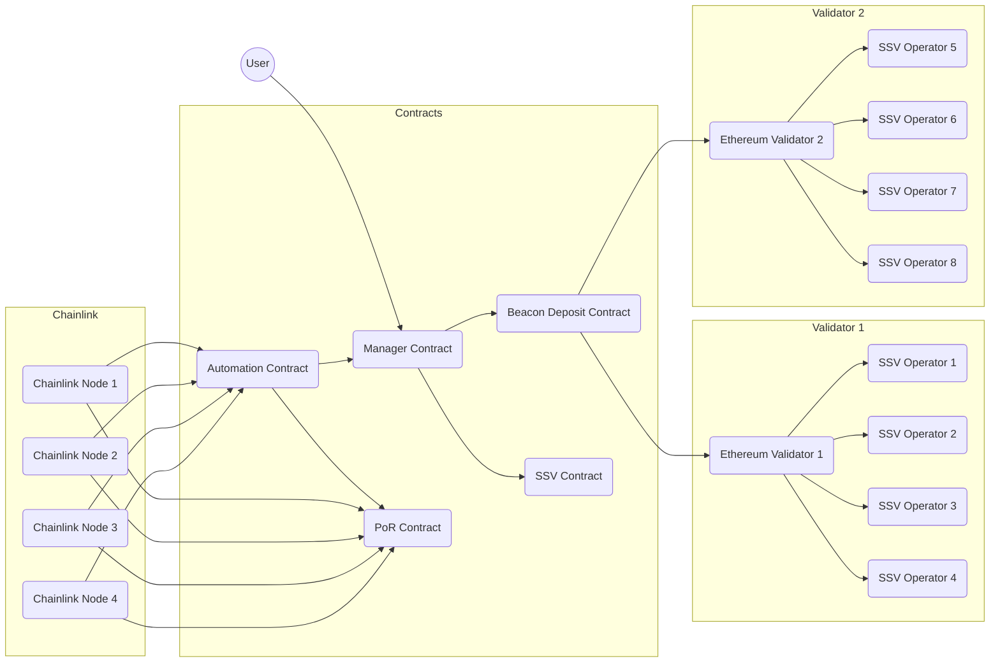

# @casimir/ethereum

Solidity contracts for decentralized staking on Ethereum

## Overview

Casimir distributes user deposits to Ethereum validators operated by SSV. Validator keys are shared with zero-coordination distributed key generation. Chainlink nodes report from the Beacon chain and SSV to sync rewards, manage slashing, and automate validator creation and exiting.

### Architecture

Todo add some general notes. Below is a high-level diagram of the Casimir staking architecture.

### Contracts

Todo add some general notes. Below is a table of the core Casimir contracts.

| Contract | Description | Docs |
| --- | --- | --- |
| [CasimirManager](./src/CasimirManager.sol) | Manages stake distribution | [docs/index.md#casimirmanager](./docs/index.md#casimirmanager) |
| [CasimirAutomation](./src/CasimirAutomation.sol) | Automates event handling | [docs/index.md#casimirautomation](./docs/index.md#casimirautomation) |

> 🚩 The Casimir contracts are located in the [src](./src) directory. They are configured with a Hardhat development environment in the [hardhat.config.ts](./hardhat.config.ts) file.

### Distributed Key Generation

Casimir trustlessly distributes validator key shares to operators using the [rockx-dkg-cli](https://github.com/RockX-SG/rockx-dkg-cli). The DKG server is called via [Automated Chainlink Functions](https://docs.chain.link/chainlink-functions/tutorials/automate-functions/) to generate, reshare, and exit validators.

### Oracles

The contract loosely depends on two decentralized oracles. The first oracle provides a PoR feed aggregating the total of all Casimir validator balances on the Beacon chain. The second oracle automates checking balance changes, responds with relevant validator actions, and updates the contract (only when necessary conditions are met). See more about Chainlink PoR feeds [here](https://docs.chain.link/data-feeds/proof-of-reserve). See more about Chainlink automation upkeeps [here](https://docs.chain.link/chainlink-automation/introduction).

## Users

Users can deposit any amount of ETH to the manager contract. Their deposits are staked to validators run by SSV operators (see [Operators](./README.md#operators)), and their rewards are auto-compounded into their total stake.

### User Fees

The contract charges a small user fee for each deposit (and some amount TBD in reward distribution) to fund the contract's operations. The fee is a percentage of the amount deposited by a user or reward distibution.

**User Fee Calculation:**

1. $feePercent = fees_{LINK} + fees_{SSV}$

2. $ethAmount = depositAmount\times{\frac{100}{100 + feePercent}}$

3. $feeAmount = depositAmount - ethAmount$

*Where:*

- $fees_{LINK}$ is the LINK fee percentage, which is [**`getLINKFee()`**](./docs/index.md#getlinkfee) in the contract.
- $fees_{SSV}$ is the SSV fee percentage, which is [**`getSSVFee()`**](./docs/index.md#getssvfee) in the contract.
- $feePercent$ is the total fee percentage, which is the sum of the LINK and SSV fees.
- $depositAmount$ is the amount of ETH deposited.
- $ethAmount$ is the amount of ETH to be distributed into the contract.
- $feeAmount$ is the amount of ETH to be swapped for LINK and SSV to operate the contract.

### User Stake

The manager contract adjusts a user's stake based on the change in the total reward-to-stake distribution sum since their last interaction with the contract. Each time new rewards are distributed (after either a heartbeat interval or a threshold change is detected in the oracle), the distribution sum is updated and the new rewards are staked in an auto-compounding fashion.

**User Stake Calculation:**

1. Whenever a user deposits or updates their stake, their initial stake and the current distribution sum are recorded.
2. When rewards are distributed, the distribution sum is updated to include the new reward-to-stake ratio.
3. $userStake =userStake_0\times{\frac{distributionSum}{userDistributionSum_0}}$ calculates a user's current compounded stake at any time.

*Where:*

- $userStake$ is the calculated current stake of the user, including compounded rewards. This is [**`users[userAddress].stake`**](./docs/index.md#user) in the contract.
- $userStake_0$ is the initial stake of the user at the time of their last deposit or stake update. This is also [**`users[userAddress].stake`**](./docs/index.md#user) in the contract, but it is accessed before settling the user's current stake.
- $distributionSum$ is the current cumulative sum of reward-to-stake ratios in the contract. This is [**`distributionSum`**](./docs/index.md#distributionsum) in the contract.
- $userDistributionSum_0$ is the cumulative sum of reward-to-stake ratios at the time the user made their last deposit or update to their stake. This is [**`users[userAddress].distributionSum0`**](./docs/index.md#user) in the contract.

### User Withdrawals

Users can initiate a withdrawal of any amount of their stake at any time. **Full exits and withdrawal liquidity are still a WIP.** In the meantime, valid user withdrawals up to the to total current `readyDeposits` will be fulfilled by the contract. Note, more notes are coming soon on withdrawal liquidity, alongside an additional contract.

## Operators

Casimir validators are run by four registered operators, each holding a key share to sign attestations. Registration is open to any SSV operator (see [Operator Registration](./README.md#operatorregistration). Operators are selected by an algorithm that emphasizes a mix of performance and decentralization (see [Operator Selection](./README.md#operatorselection)) as user's deposit stake and new validators are required.

### Operator Registration

Operators can join the contract registry with a small deposit of ETH for slashing collateral (see [Operator Collateral](./README.md#operatorcollateral)) and a lightweight SSV node config add-on (see [Operator Config](./README.md#operatorconfig)).

### Operator Selection

Operators are chosen to run validators based on metrics fetched and derived directly from the SSV network, mainly performance, market share, and fees.

Todo @elizyoung0011 - we should add your details about operator selection and performance monitoring thresholds.

Operator performance is reported by (Chainlink) monitoring SSV exporter attestations. If an operator's performance is poor for an extended period of time, and their slashing collateral is below a threshold, Casimir removes the operator from existing operator groups by resharing or exiting. The latter is only required in the rare case that a validator has already undergone more than two reshares to avoid leaving the full key recoverable outside of the currently selected operators.

### Operator Collateral

Todo add notes.

### Operator Config

Operators will need to follow the [node onboarding process from RockX](https://github.com/RockX-SG/rockx-dkg-cli/blob/main/docs/dkg_node_installation_instructions.md) to participate in DKG make their node available to new validator selections. Todo add details.
